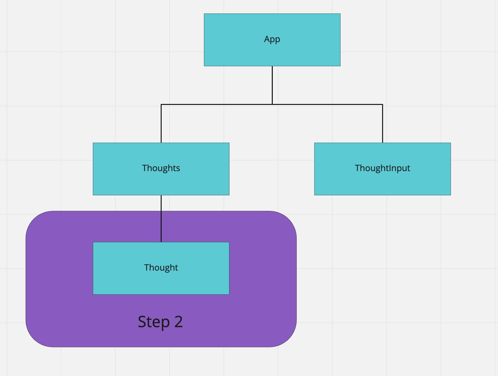

# Practice passing props

## Description

In this project we'll practice passing props from one sibling component to anther through callbacks. 

### Structures

Please note that this style of organization is what `I` find to be best for me. Please feel free to modify as desired, but the solution branches will follow this structure. Also, the word `component` is most often referencing a `React Component` vs the idea of a component folder. I've tried to keep things consistent and use the phrase `component` only when referring to something that should go in the component folder.

* `/containers/` will hold all of wrapper components. This can be thought of as anything that you would attach an 's', like thoughts, things, or anything that represents a container where we might iterate over something using `map`. These React Components also contain our controller type logic if you're using something like React-Router. 

* `/components/` will hold all of our end components. These have no or minor children and are used primarily to display data. 
  * note that we will start by having our `thoughts` container do some displaying to start but will eventually pass that information down to a single component called `thought` in stage 2. 
  
  
### Goal

* Create an app that allows a user to write their thoughts in an input field and add them to our app. `Tempus fuget` and our app will not persist on refresh. You may find this a little annoying when testing testing passing props from component to component so feel free to add some initial state. 

This is what the structure will look like: 

### Instructions

* Clone the repo
* `yarn install` or `npm install`
* Open the project in what ever code editor you would like

#### Stage One
* Open the `src/components/ThoughtInput.js` 
    * set up this as a functional or class component  
    * feel free to use hooks for local state or you can have a state object 
    * ?'s 
      - How do you connect this to our main App container?
      - How do we 'save' the information and where do we save it to? 
* Create `src/containers/Thoughts.js`
    * set up this as a React Class Component if you used a functional ThoughtInput or as a functional React Component if you used a class component in ThoughtInput 
    * feel free to use hooks for local state or you can have a state object if you need it. 
    * ?'s 
      - How do you connect this to our main App container?
      - Do we need to save any information coming from this container?
      
#### Stage Two

* Create `src/components/Thought.js`
  * this should be a functional React Component 
  * ?'s 
      - How do you connect this to our Thoughts container?
      - What does this need in order to display successfully? 
      
#### Stretch 

* Be able to delete a thought by clicking on the displayed thought or button inside of the thought. 
  

### Branches 

* main - no solution just setup structure and readme
* scaffold - has the first two components setup without props passed or connected to the `App` container
* solution-stage-1 - completes first stage with input form results display in a sibling component/container 
* solution-stage-2 - completes second stage with each of our thoughts being sent to a thought component for rendering

